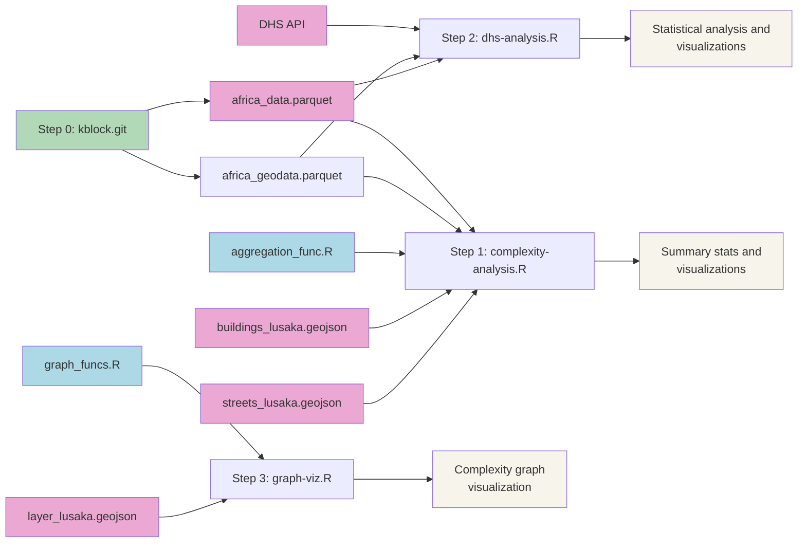

## Analysis of street access and development in sub-Saharan Africa

### Block complexity aggregation and visualization:

* [complexity-analysis.R](https://github.com/mansueto-institute/kblock-analysis/blob/main/complexity-analysis.R) aggregates the block level data and generates several visualizations used in the analysis. The script uses [aggregation_func.R](https://github.com/mansueto-institute/kblock-analysis/blob/main/aggregation_func.R) to facilitate aggregation from the the block level to higher geographic scales.
* This script will automatically download several GB of block level data and add it to folders within the top level of the repo. The data is available at this website: [millionneighborhoods.africa](https://www.millionneighborhoods.africa/download). The script also uses the following files in this repo: [data
/buildings_lusaka.geojson](https://github.com/mansueto-institute/kblock-analysis/blob/main/data/buildings_lusaka.geojson), [data/streets_lusaka.geojson](https://github.com/mansueto-institute/kblock-analysis/blob/main/data/streets_lusaka.geojson). Data sources and methods for generating the block level population and informality data are available in the [mansueto-institute/kblock](https://github.com/mansueto-institute/kblock) repo.

### Demographic and Health Survey (DHS) statistical analysis:

* [dhs-analysis.R](https://github.com/mansueto-institute/kblock-analysis/blob/main/dhs-analysis.R) downloads [DHS data](https://dhsprogram.com/) via an API connection, spatial joins to the block level database, and performs a statistical analysis that runs correlations, PCA, and regressions on the relationships between block complexity and social development indicators corresponding to human well-being and household characteristics.
* This script must be run after the step in the [complexity-analysis.R](https://github.com/mansueto-institute/kblock-analysis/blob/main/complexity-analysis.R)  that downloads the block level database. When running on your own computer please be sure to register and add your own [DHS login credentials](https://github.com/mansueto-institute/kblock-analysis/blob/main/dhs-analysis.R#45) to the script (this requires undergoing a dataset access approval process). The pre-processing steps that involve API calls to the DHS website and spatial joins may take an hour of processing time. This script also uses data downloaded from [data/un-habitat](https://github.com/mansueto-institute/kblock-analysis/tree/main/data/un-habitat).
* DHS and UN data sources listed [here](https://github.com/mansueto-institute/kblock-analysis/blob/main/dhs-analysis.R#L1625).

### Block complexity graph visualizations:

* [graph-viz.R](https://github.com/mansueto-institute/kblock-analysis/blob/main/graph-viz.R) visualizes block complexity in the format of a network graph. This script uses the [graph_funcs.R](https://github.com/mansueto-institute/kblock-analysis/blob/main/graph_funcs.R) to generate a complexity graph.
* The script uses [data/layer_lusaka.geojson](https://github.com/mansueto-institute/kblock-analysis/blob/main/data/layer_lusaka.geojson), which contains data for a community area in Lusaka, Zambia. 

### Workflow diagram:

## Details on R environment for replication

* R version 4.1.2 (2021-11-01)
* Platform: aarch64-apple-darwin20 (64-bit)
* Running under: macOS 13.4.1

| Package | Version | | Package | Version | | Package | Version |
|---|---|- |---|---|- |---|---|
| tidyverse | 1.3.1 | | broom | 1.0.3 | | readxl | 1.3.1 | 
| sf | 1.0-8 | | betareg | 3.1-4 | | osmdata | 0.1.9 |
| units | 0.8-0 | | ggpmisc | 0.5.2 | | Hmisc | 4.8-0 | 
| viridis | 0.6.2 | | kableExtra | 1.3.4 | | scatterpie | 0.1.7 |
| patchwork | 1.1.1 | | xtable | 1.8-4 | | tidymodels | 0.2.0 | 
| scales | 1.2.1 | | ggplot2 | 3.4.1 | | ggrepel | 0.9.3 |
| rdhs | 0.7.5 | | tidygeocoder | 1.0.5 | | readr | 2.1.1 | 
| rmapshaper | 0.4.6 | | writexl | 1.4.0 | | DescTools | 0.99.48 |
| arrow | 7.0.0 | | ggsn | 0.5.0 | | ggpubr | 0.6.0 | 
| sfarrow | 0.4.1 | | geoarrow | 0.0.0.9000 | 

## Contact 
Nicholas Marchio, data scientist at the Mansueto Institute. For any technical inquiries please feel free to create a Git issue and tag `nmarchio`. 

For related technical work see the following repos:
* [kblock](https://github.com/mansueto-institute/kblock): Python codebase for generating the underlying block complexity and population data available at [millionneighborhoods.africa](millionneighborhoods.africa).
* [geopull](https://github.com/mansueto-institute/geopull): Python package for extracting OSM data and generating street block delineations.
* [cloudtile](https://github.com/mansueto-institute/cloudtile): CLI for converting (Geo)Parquet files to PMTiles on AWS.
* [prclz](https://github.com/mansueto-institute/prclz): Python codebase from previous iteration of block complexity research (see kblock for more recent version).
