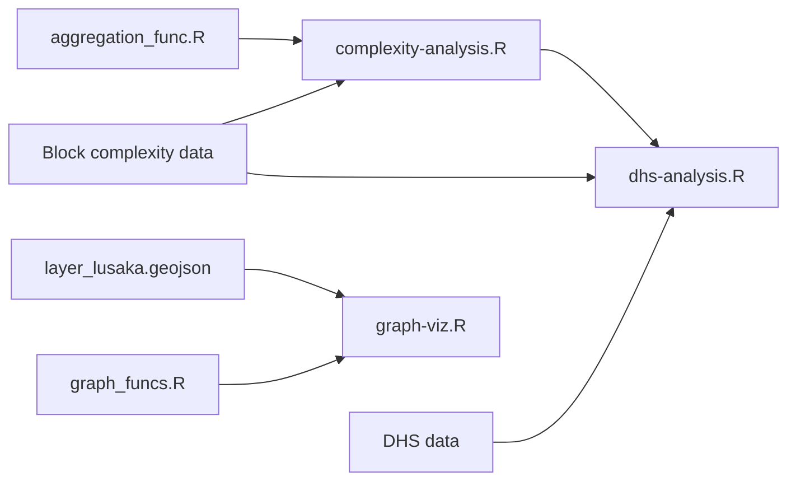

## Analysis of street access and development in sub-Saharan Africa

### Block complexity aggregation and visualization:

* [complexity-analysis.R](https://github.com/mansueto-institute/kblock-analysis/blob/main/complexity-analysis.R) aggregates the block level spatial data and generates several visualizations used in the analysis. 
* [aggregation_func.R](https://github.com/mansueto-institute/kblock-analysis/blob/main/aggregation_func.R) is a function to facilitate aggregation from the the block level to higher geographic scales.
* [millionneighborhoods.africa](https://www.millionneighborhoods.africa/download) is the online block-level database used in this analysis.

### Demographic and Health Survey (DHS) statistical analysis:

* [dhs-analysis.R](https://github.com/mansueto-institute/kblock-analysis/blob/main/dhs-analysis.R) downloads [DHS data](https://dhsprogram.com/) via an API connection, joins to the block level database (referenced above), and performs a statistical analysis that runs correlations, PCA, and regressions on the relationships between block complexity and social development indicators corresponding to human well-being and household characteristics.

### Block complexity graph visualizations:

* [graph-viz.R](https://github.com/mansueto-institute/kblock-analysis/blob/main/graph-viz.R) visualizes block complexity in the format of a network graph.
* [graph_funcs.R](https://github.com/mansueto-institute/kblock-analysis/blob/main/graph_funcs.R) contains function to generate a complexity graph.
* [layer_lusaka.geojson](https://github.com/mansueto-institute/kblock-analysis/blob/main/data/layer_lusaka.geojson) contains data for two community areas in Lusaka, Zambia. 

### Workflow diagram:

## Contact 
Nicholas Marchio, data scientist at the Mansueto Institute

For related technical work see the following repos:
* [kblock](https://github.com/mansueto-institute/kblock): Python codebase for generating the block complexity and population data available at [www.millionneighborhoods.africa](millionneighborhoods.africa).
* [geopull](https://github.com/mansueto-institute/geopull): Python package for extracting OSM data and generating street block delineations.
* [cloudtile](https://github.com/mansueto-institute/cloudtile): contains code for converting (Geo)Parquet files to PMTiles on AWS.

